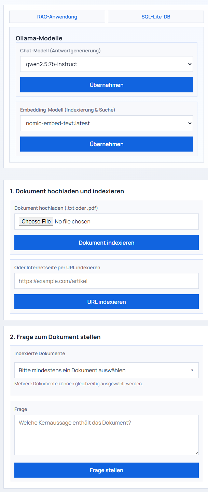
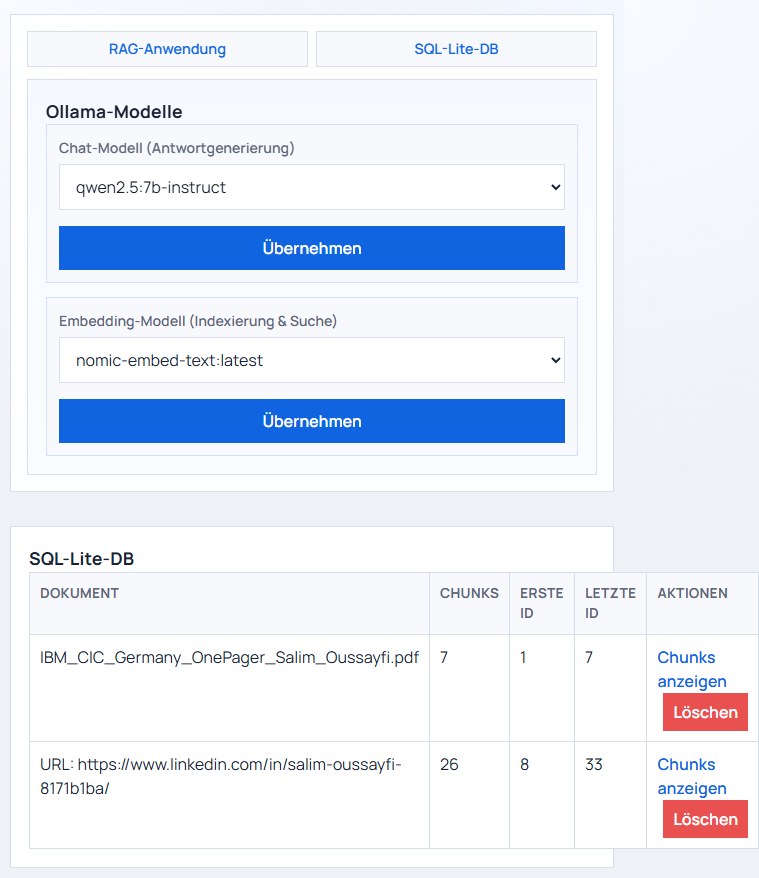
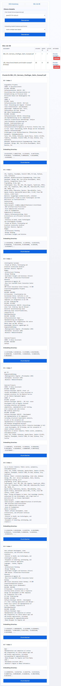

# Local LLM RAG Demo App

A local AI Engineering demo app that ingests TXT/PDF files or public URLs, chunks and embeds the text, stores the results in SQLite, and answers questions with a local Ollama-backed model.

This repository is intentionally simple, transparent, and easy to run locally. It is designed as a portfolio project, not a production-ready RAG platform.

## TL;DR Run Commands

1. Backend and web UI:

```powershell
python -m venv .venv
.venv\Scripts\Activate.ps1
pip install -r requirements.txt
python app.py
```

2. API:

```powershell
uvicorn api:app --reload --port 8000
```

3. Open the app:

```text
http://127.0.0.1:5000
http://127.0.0.1:8000/docs
```

## Screenshots

### Home



### DB overview



### Chunk detail



## What this project demonstrates

• Local document ingestion from TXT, PDF, and public URLs
• Text chunking with overlap
• Embedding generation with local Ollama models
• Storage of chunks and embeddings in SQLite
• Semantic retrieval with cosine similarity and top-k selection
• Answer generation grounded in retrieved context
• A simple Flask UI plus a lightweight FastAPI interface

## Why this is a strong AI Engineering reference project

• End-to-end RAG flow from ingestion to grounded answers
• Provider abstraction through a local Ollama client
• Defensive URL ingestion for safer demo usage
• Deterministic tests for chunking, similarity, and document handling
• A clean local demo that is easy to explain in interviews and portfolio reviews

## Use case

A developer uploads a policy document or points the app at a public URL. The app breaks the content into chunks, embeds those chunks, stores them in SQLite, and answers questions using the most relevant retrieved passages.

This is a practical RAG demo, not a general-purpose knowledge base or enterprise search system.

## Tech stack

• Python 3.11+
• Flask for the web UI
• FastAPI + Uvicorn for the API
• SQLite for persistence
• Ollama for local embeddings and generation
• pypdf and requests for document ingestion
• pytest and black for testing and formatting

## Architecture

```text
Browser / API client
    |
    v
app.py or api.py
    |
    v
RagService
   |        |        |
   |        |        +--> OllamaService
   |        +------------> documentservice.py
   +---------------------> database.py
    |
    v
SQLite + local Ollama models
```

The flow is intentionally explicit:

1. Load a document from upload or URL.
2. Extract text.
3. Split the text into chunks.
4. Generate embeddings per chunk.
5. Store chunks and embeddings in SQLite.
6. Build a query embedding for the user question.
7. Rank chunks by cosine similarity.
8. Generate the answer from the top chunks.

## Project structure

```text
rag-demo-app/
├── app.py
├── api.py
├── config.py
├── database.py
├── documentservice.py
├── ollamaservice.py
├── ragservice.py
├── requirements.txt
├── README.md
├── .env.example
├── .github/
│   └── workflows/
│       └── tests.yml
├── assets/
│   └── screenshots/
│       ├── 01-home.png
│       ├── 02-db-overview.png
│       └── 03-db-chunks.png
├── examples/
│   └── company_policy.txt
├── templates/
│   └── index.html
├── tests/
│   ├── test_chunking.py
│   ├── test_documentservice.py
│   └── test_similarity.py
└── uploads/
```

## Quickstart

### 1. Create and activate a virtual environment

Windows PowerShell:

```powershell
python -m venv .venv
.venv\Scripts\Activate.ps1
```

### 2. Install dependencies

```powershell
pip install -r requirements.txt
```

### 3. Configure environment

Copy `.env.example` to `.env` if you want to override defaults such as the upload directory, DB path, or Ollama base URL.

### 4. Ensure Ollama is available

Example setup:

```powershell
ollama pull qwen2.5:7b-instruct
ollama pull nomic-embed-text
```

### 5. Run the web UI

```powershell
python app.py
```

Open:

```text
http://127.0.0.1:5000
```

### 6. Run the API

```powershell
uvicorn api:app --reload --port 8000
```

Open:

```text
http://127.0.0.1:8000/docs
```

## UI usage

The Flask UI lets you:

• upload a TXT or PDF document
• ingest a public URL
• switch chat and embedding models
• ask a question against one or more indexed documents
• inspect stored chunks in the SQLite view

## API overview

• `GET /api/health`
• `GET /api/ollama/status`
• `POST /api/ollama/chat-model`
• `POST /api/ollama/embedding-model`
• `GET /api/documents`
• `POST /api/documents/url`
• `POST /api/ask`
• `DELETE /api/documents/{document_name}`

## Example request

PowerShell example for the question-answering endpoint:

```powershell
$body = @{
  document_names = @("IBM_CIC_Germany_OnePager_Salim_Oussayfi.pdf")
  question = "What is the main security requirement?"
} | ConvertTo-Json

Invoke-RestMethod -Uri http://127.0.0.1:8000/api/ask -Method Post -ContentType 'application/json' -Body $body | ConvertTo-Json -Depth 8
```

URL ingest example:

```powershell
$body = @{ url = "https://example.com" } | ConvertTo-Json
Invoke-RestMethod -Uri http://127.0.0.1:8000/api/documents/url -Method Post -ContentType 'application/json' -Body $body | ConvertTo-Json -Depth 8
```

## Testing

```powershell
pytest -q
```

The tests are designed to run without a live local model for the covered utility paths.

## CI

GitHub Actions runs the test suite on push and pull requests.

## Limitations

• No authentication or authorization
• No multi-user isolation
• No background processing for larger ingests
• SQLite only
• Demo-first architecture, not a production RAG deployment

## Portfolio positioning

This project complements a local ticket triage app and a log analysis app by showing a third pattern: document-grounded retrieval and answer generation.

Together, the three repos show different local LLM workflows for AI Engineering portfolios.

## License

No explicit license file is included yet.
